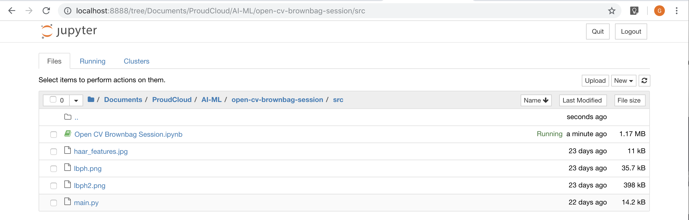

# Open CV Brownbag Session

The Open CV Brownbag Session for ProudCloud

## Getting Started

These instructions will get you a copy of the project up and running on your local machine for development and testing purposes. See deployment for notes on how to deploy the project on a live system.

### Prerequisites

You will need to install Anaconda found in this link - [Downloads - Anaconda](https://www.anaconda.com/download/) - Python Version 3.7 (64-Bit Graphical Installer is preferred)

#### Mac OS Installation
https://www.datacamp.com/community/tutorials/installing-anaconda-mac-os-x

#### Windows Installation
https://medium.com/@GalarnykMichael/install-python-on-windows-anaconda-c63c7c3d1444


### Setting up the environment

Create an environment using Anaconda Navigator. Set the Python Package to version <b>3.7 (lastest)</b> and click create.


Once the Anaconda Environment has been created, activate it using your terminal/command prompt.

#### Mac OS

```
$conda activate <env_name>
```

#### Windows
```
activate <env_name>
```


You are now in the virtual environment that you have created. A virtual environment isolates all python and OS dependencies for the sake of modularity and organization.
Now, we should start installing the dependencies needed for OpenCV.
#### Automatic Installation

Import environment by clicking on Environments then <b> import</b> using the <i>environment.yaml</i> file provided in the GitHub repository.


#### Manual Installation
```
$ conda install -c conda-forge opencv -y
$ conda install matplotlib -y
$ conda install -c anaconda pillow -y
```


### Installing and Running using Jupyter Notebook

If proceeded with the automatic installation, you need not install jupyter notebook. Rather, you may proceed to launch the instance.


Proceed to open the .ipynb file


